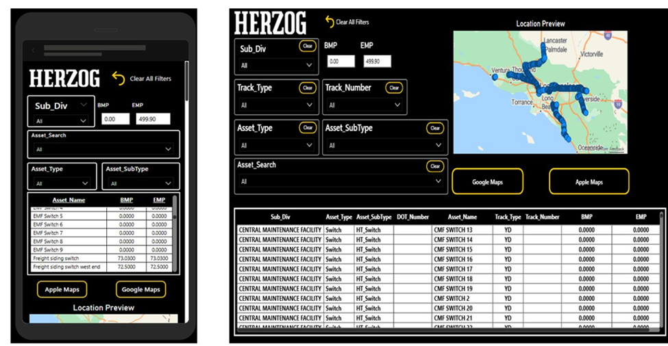

```markdown
**Rail Authority Awareness & Navigation Platform (RAANP)**

**System Overview & Delivery Specification**

## 1. Summary

This platform is a mobile and web-based railroad situational awareness system designed to improve operational safety, coordination, and field efficiency. This App should allow for two types of authority to be entered but only 1 at a time. It will be Track Authority or a Lone Worker Authority to allow people that are traveling on tracks to identify where people are potentially walking track.

The system combines:

- Offline railroad mapping and navigation
- Authority-based geofencing
- Real-time multi-user proximity alerts
- Configurable field data collection
- Enterprise-grade security and scalability

The platform is designed as a multi-agency, configurable product, not a single-purpose application. All terminology, workflows, alert thresholds, and user experience elements are fully configurable to match each railroad's operating rules and branding. Design it all in White and Black as the main colors with the Yellow specifically FFD100 to be an indicator color etc. Example below of the color scheme but again make it all configurable but start with the below theme.

![A screenshot of a phone AI-generated content may be incorrect.]


The system will integrate directly with the client's on-premises SQL Server environment.

## 2. What Will Be Delivered

The delivery is a complete operational platform, not only a mobile app.

### 2.1 Mobile Applications (iOS & Android)

A unified mobile application will be delivered for Apple and Android devices featuring:

- GPS-based railroad navigation
- Follow-Me mode and compass while in follow me mode I want it to display the track they are on and the milepost so that as they travel the milepost changes etc. The video I sent captures the follow me function just need to add the milepost and track type and track number to the top right or somewhere visible but not overwhelming.
- Online and offline railroad maps
- Authority boundary monitoring
- Multi-user safety alerts
- Configurable pin drops and trip reports

Built with a single shared codebase for long-term maintainability. Preferably in SQL if possible.

### 2.2 Web-Based Administration Portal

A secure web portal for system administration:

- User and role management
- Agency and subdivision management
- Authority rules configuration
- Alert distance configuration
- Dropdown and form configuration
- Branding and theming control
- System audit logs and reporting

This ensures the client can independently operate and scale the system.

### 2.3 Backend Intelligence Platform

A central services layer that provides:

- Authority overlap detection (this should be based off the users inputting their authority as I described and utilizing the app and the gps from their mobile devices being used)
- Proximity calculations. This should be indicated by the GPS ping from their devices when using the app
- Notification orchestration
- Offline data synchronization
- Integration with on-prem SQL Server

## 3. System Architecture Overview

```
Client On-Prem SQL Server

Backend Intelligence Platform

Mobile Apps (iOS / Android)

Secure API Secure Data Sync
```

The system is designed as a **hybrid architecture**:

- Field operations continue to work offline. (This should be for navigational purposes I am not sure if you can code the GPS cords to notify if the mobile device is in offline mode)
- Central intelligence synchronizes when connected
- All authoritative datasets remain owned by the client. I want to have a clear template that is almost a drop and load style so that as it scales incorporating new locations/ editing locations is seamless

## 4. On-Prem SQL Server Integration

The platform connects directly to the client's existing SQL Server environment to ingest and synchronize:

### 4.1 Asset & Track Data

From the provided datasets:

**Infrastructure Dataset Example Fields**

| **Column**       | **Purpose**                  |
|------------------|------------------------------|
| Agency_CD        | Agency identifier            |
| Sub_Div          | Subdivision                  |
| Region           | Region                       |
| LS               | Line segment                 |
| Track_Type       | Main, Yard, Siding           |
| Track_Number     | Track ID                     |
| BMP              | Begin Milepost               |
| EMP              | End Milepost                 |
| Asset_Name       | Human-readable name          |
| Asset_Type       | Switch, Signal, Crossing     |
| Asset_SubType    | HT_Switch, PWR_Switch        |
| Latitude         | GIS coordinate               |
| Longitude        | GIS coordinate               |
| Asset_Status     | Active/Inactive              |

**Milepost Geometry Dataset Example Fields**

| **Column**    | **Purpose**          |
|---------------|----------------------|
| Subdivision   | Subdivision name     |
| MP            | Milepost             |
| Latitude      | GIS coordinate       |
| Longitude     | GIS coordinate       |

These datasets allow:

- Precise milepost-to-map alignment
- Precise track-to-map alignment
- Authority corridor creation
- Distance-to-boundary calculations

## 5. Authority Management System

### 5.1 Authority Input Model (Configurable Naming)

Each agency defines its own naming conventions. Default structure:

| **Field**           | **Description**                   |
|---------------------|-----------------------------------|
| Employee_Name       | Operator name                     |
| Employee_Contact    | Phone number                      |
| Subdivision         | Railroad subdivision              |
| Begin_Milepost      | Start limit                       |
| End_Milepost        | End limit                         |
| Track_Type          | Main, Siding, Yard                |
| Track_Number        | Track ID                          |
| Authority_Type      | Optional classification           |
| Start_Time          | Activation time                   |
| Expiration_Time     | Auto-expire                       |

They can put a place holder time from the authority granted but should be a physical button that is required to be selected to end the tracking to show that they are clear of the authority.

All field labels are configurable per agency.

### 5.2 Authority Boundary Alerts

The system continuously monitors:

- Distance to Begin MP
- Distance to End MP

Alert distances are fully configurable per agency:

| **Level**        | **Example Distance** |
|------------------|----------------------|
| Informational    | 1.0 mile             |
| Warning          | 0.75 mile            |
| Critical         | 0.50 mile            |

Alerts are triggered using **track-distance, not straight-line GPS distance**, ensuring operational accuracy. Need to use GPS from their device

## 6. Multi-User Conflict Detection

### 6.1 Authority Overlap Engine

When an authority is entered:

The system automatically checks:

- Same subdivision
- Same track type and number
- Overlapping milepost ranges

If overlap is detected:

Both users receive an alert containing:

- Name
- Contact number
- Overlapping limits

### 6.2 Proximity Monitoring

If overlapping authorities exist, the system monitors real-time proximity:

Configurable alert radii:

- 1.0 mile
- 0.75 mile
- 0.50 mile
- 0.25 mile

Alerts escalate as users approach.

## 7. Offline Mapping & Field Operation

Users can pre-download:

- Agencies
- Subdivisions
- Track maps
- Milepost geometry
- Asset layers

All functions remain operational without connectivity. Automatic synchronization occurs when service returns.

## 8. Field Pin Drops & Trip Reporting

### 8.1 Configurable Pin Types

Pin categories are **data-driven**, not hardcoded.

Example default set:

- Scrap -- Rail
- Scrap -- Ties
- Monitor Location

Administrators can add, remove, or rename categories at any time.

### 8.2 Trip Summary Export

At trip completion:

The system generates a report containing:

- Pin type
- GPS coordinates
- Track Type
- Track Number
- MP location
- Time
- Notes
- Photos

Export formats:

- Email summary
- PDF
- Excel

## 9. Customization & White-Labeling

Each agency can fully customize: This should all be set by me and not allow agencies etc to customize logos or anything else. Essentially, I will be the app owner and can grant access if I deem necessary but ultimately will be assigned to me and I should be notified by email if configurations change within the desktop or mobile app.

| **Area**             | **Customizable** |
|----------------------|------------------|
| App name             | Yes              |
| App colors           | Yes              |
| Logos                | Yes              |
| Terminology          | Yes              |
| Alert thresholds     | Yes              |
| Authority fields     | Yes              |
| Pin categories       | Yes              |

This enables rapid onboarding of new customers without redevelopment.

## 10. Access Control & Security

Role-based permissions:

| **Role**        | **Capabilities**            |
|-----------------|-----------------------------|
| Administrator   | Full system control         |
| Dispatcher      | Authority management        |
| Supervisor      | Oversight & reports         |
| Field User      | Mobile operations           |

Security includes:

- Encrypted location data
- Audit logging
- Authority history tracking
- Device authentication

## 11. Scalability Model

The system is built as a multi-tenant platform:

- Each agency is logically isolated
- Shared core infrastructure
- Independent configuration

This allows:

- Fast customer onboarding
- Minimal incremental cost per customer
- Long-term platform growth

## 12. Client Control & Ownership

Per client request, the delivery includes:

- Full source code ownership
- Database schemas
- System architecture documentation
- Deployment scripts
- Configuration manuals
```